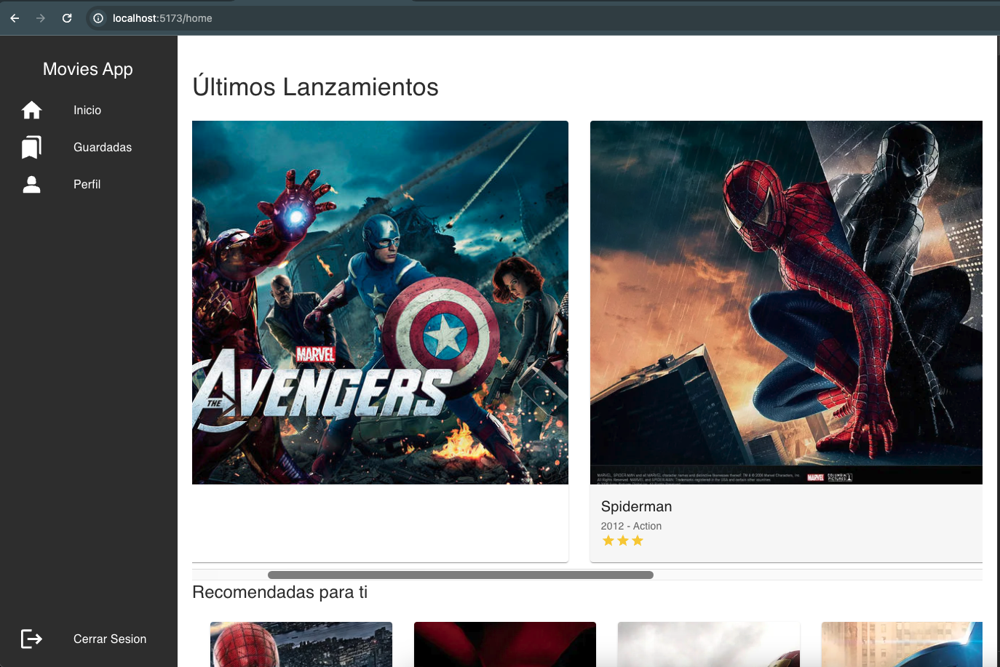

# Approach

To complete the objective of this app, an interface was developed with React js, Material UI.

This is a movie app, where we have a login, we can see the movies classified by different categories and a brief description of the movie.

5 endpoints for login, get latest releases, get categories, get movies by category and get data about each movie.



# Movies Frontend

This is the frontend of a movies application that allows see information about different movies. It is developed with React js, Material UI and also Prettier, Eslint and Husky to code formatter.

## Requirements and Configuration

Ensure Node.js is installed.

## Installation and Execution

    1. Clone the repository: git clone <URL>

    2. Install dependencies: npm install

    3. Run the application: npm run dev

## Folder Structure

The project follows an organized structure inspired by components architecture, enhancing maintainability and clarity. Key components are organized as follows:

    /src: Contains the application's source code.
        /components: Components handling views.
        /pages: Main route components.
        /services: Services encapsulating application data and shareable between backend.

## API Reference

#### Login

```http
  POST /login
```

#### Get categories

```http
  GET /categories
```

Example response service:

```json
dataCategories = [
{
id: 1,
category: 'Recomendadas para ti'
},
{
id: 2,
category: 'Seguir viendo'
},
{...}]
```

#### Get realeses

```http
  GET /releases
```

Example response service:

```json
dataRealeses = [
{
id: 10,
imageUrl: 'imageUrl',
description: {
name: 'Avengers',
year: '2012',
genre: 'Action',
stars: '3'
}
},
{...}
]
```

#### Get movies by category

```http
  GET /movies
```

| Parameter | Type   | Description    |
| :-------- | :----- | :------------- |
| id        | number | Id of category |

#### Get movie

```http
  GET /movie
```

| Parameter | Type   | Description |
| :-------- | :----- | :---------- |
| id        | number | Id of movie |
